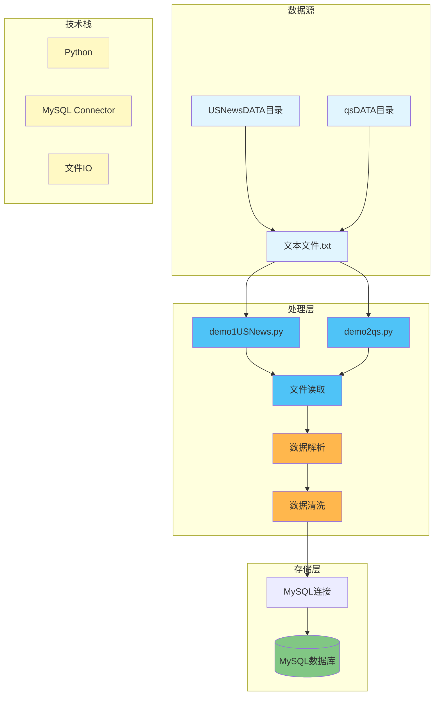
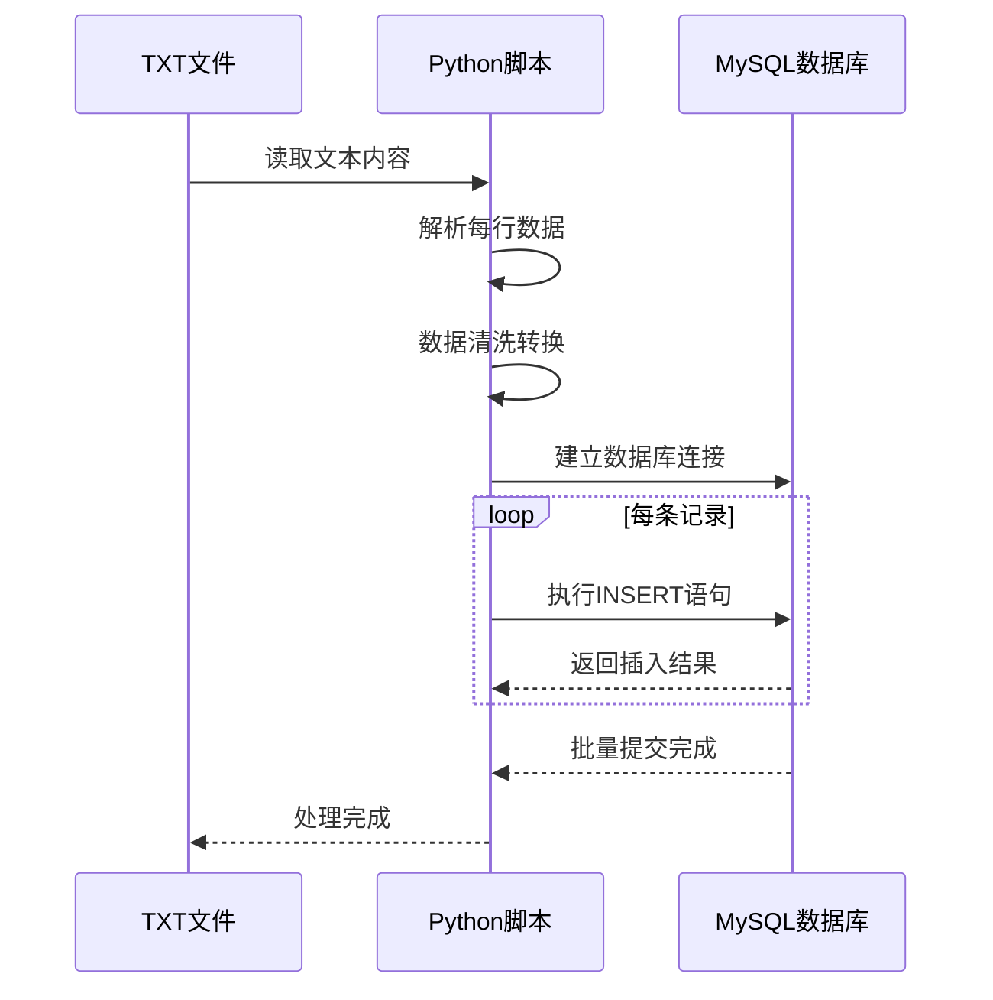
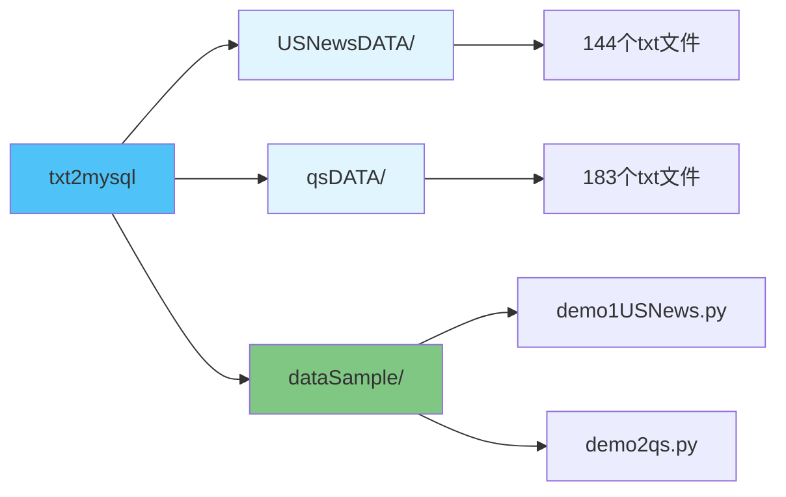
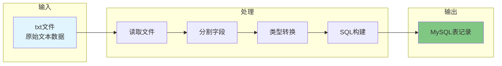

# txt2mysql
用Python，读取txt数据，然后存入MySQL

## 项目架构

```mermaid
graph TB
    subgraph 数据源
        A[USNewsDATA目录] --> C[文本文件.txt]
        B[qsDATA目录] --> C
    end

    subgraph 处理层
        C --> D[demo1USNews.py]
        C --> E[demo2qs.py]
        D --> F[文件读取]
        E --> F
        F --> G[数据解析]
        G --> H[数据清洗]
    end

    subgraph 存储层
        H --> I[MySQL连接]
        I --> J[(MySQL数据库)]
    end

    subgraph 技术栈
        K[Python]
        L[MySQL Connector]
        M[文件IO]
    end

    style A fill:#e1f5fe
    style B fill:#e1f5fe
    style C fill:#e1f5fe
    style D fill:#4fc3f7
    style E fill:#4fc3f7
    style F fill:#4fc3f7
    style G fill:#ffb74d
    style H fill:#ffb74d
    style J fill:#81c784
    style K fill:#fff9c4
    style L fill:#fff9c4
    style M fill:#fff9c4
```

## 数据处理流程

```mermaid
sequenceDiagram
    participant T as TXT文件
    participant P as Python脚本
    participant M as MySQL数据库

    T->>P: 读取文本内容
    P->>P: 解析每行数据
    P->>P: 数据清洗转换
    P->>M: 建立数据库连接
    loop 每条记录
        P->>M: 执行INSERT语句
        M-->>P: 返回插入结果
    end
    M-->>P: 批量提交完成
    P-->>T: 处理完成
```

## 目录结构

```mermaid
graph LR
    A[txt2mysql] --> B[USNewsDATA/]
    A --> C[qsDATA/]
    A --> D[dataSample/]
    D --> E[demo1USNews.py]
    D --> F[demo2qs.py]
    
    B --> G[144个txt文件]
    C --> H[183个txt文件]
    
    style A fill:#4fc3f7
    style B fill:#e1f5fe
    style C fill:#e1f5fe
    style D fill:#81c784
```

## 数据转换示意

```mermaid
flowchart LR
    subgraph 输入
        A["txt文件<br/>原始文本数据"]
    end
    
    subgraph 处理
        B[读取文件]
        C[分割字段]
        D[类型转换]
        E[SQL构建]
    end
    
    subgraph 输出
        F[MySQL表记录]
    end
    
    A --> B --> C --> D --> E --> F
    
    style A fill:#e1f5fe
    style F fill:#81c784
```
